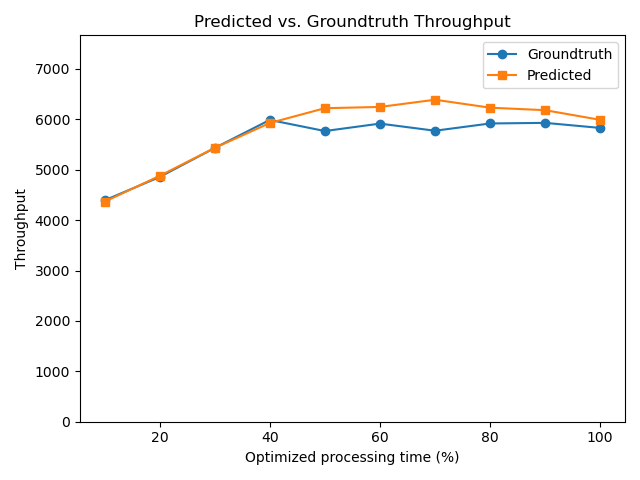
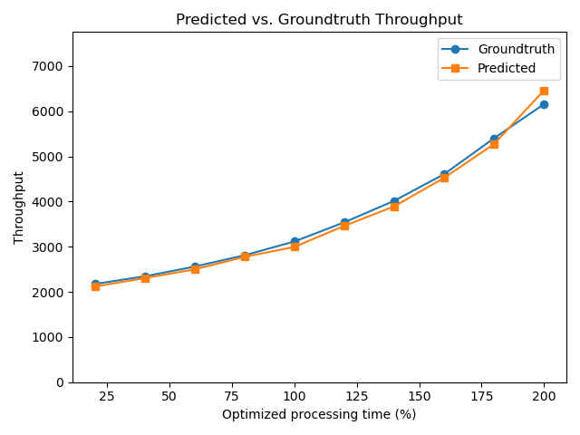

**TODO: change repo permission**

# Overview

The paper makes the following contributions, stated in page 2:

* **Slowpoke**: the system for accurate what-if analysis of throughput optimizations in complex microservice architectures.

* **A performance model**: a formal model that explains why Slowpoke can accurately predict end-to-end throughput improvements.

* **A lightweight distributed slowdown mechanism**: a per-node service controller that pause microservices in a coordinated way that enables accurate prediction.

This artifact validates the claims by running the Slowpoke system, empowered by the performance model and an effective implementation of the slowdown mechanism, to perform accurate what-if analysis on end-to-end throughput, targeting four real-world microservice benchmarks (and optionally 108 synthetic microservice applications).

This artifact targets the following badges:

* [ ] [Artifact available](#artifact-available): Reviewers are expected to confirm that Slowpoke system, benchmarks, and testing scripts are all publicly available (about 10 minutes).
* [ ] [Artifact functional](#artifact-functional): Reviewers are expected to confirm sufficient documentation, key components as described in the paper, and execution with one experiment (about 20 minutes).
* [ ] [Results reproducible](#results-reproducible): Reviewers are expected to reproduce _key_ results of section 5 of the paper (1.5 hours).

# Artifact Available (10 minutes)

The Slowpoke artifact is available at https://github.com/atlas-brown/slowpoke, commit hash XXXX.

To confim this, run

```bash
$ git clone https://github.com/atlas-brown/slowpoke
$ cd slowpoke
$ git checkout XXXX
```

The reviewer should be able to confirm that the repository is available and contains the following components:

The reviewers are expected to see 

1. Slowpoke's Go runtime is available in the [`pkg/slowpoke/`](pkg/slowpoke), the controller program (Poker) is located at [`slowpoke/poker/poker.c`](slowpoke/poker/poker.c).

2. The testing scripts are in [`slowpoke/`](slowpoke) as well as top-level scripts [`run_function.sh`](run_functional.sh) and [`run_reproducible.sh`](run_reproducible.sh).

3. Benchmarks is available in [`cmd/`](cmd) (Command line entry points) and [`internal/`](inernal) (Request handlers).


# Artifact Functional (20 minutes)

Confirm sufficient documentation, key components as described in the paper, and execution with minimal inputs (approximately 20 minutes):

In this repository, the reviewer is expected to verify

* Documentation: The top-level [README](README.md) file provides instructions for setting up Kubernetes clusters, installing dependencies, building application images with Slowpoke, generating synthetic benchmarks, and running experiments. 
* Completeness:
  * Slowpoke's user-level library: [initialization code](pkg/slowpoke/utils.go), [request handler wrapper](pkg/wrapper/wrappers.go) 
  * Poker, the controller that pauses services: [Go component](pkg/slowpoke/pause.go) [C component](slowpoke/poker/poker.c).
  * Benchmarks:
    * Four real-world benchmarks: hotel (hotelReservation), boutique (Online Boutique), social (socialNetwork), and movie (mediaMicroservices), located in [entry points](cmd/) and [request handlers](internal)), adopted from [MuCache](https://www.usenix.org/conference/nsdi24/presentation/zhang-haoran)'s porting of the original benchmarks
    * A synthetic benchmark emulator ([source](cmd/synthetic/service)) that dynamically changes behavior based on configuration files and [108 example configuration files](slowpoke/synthetic/) used in our evaluation.
* Exercisability: See below

To run Slowpoke, one needs to set up a kubernetes cluster. For artifact reviewers, we prepared the clusters on AWS. 

**IMPORTANT: Make sure you contact the authors for the account and ssh key setup**

Here is how to use them:

First, **From your local machine**, sign into the gateway machine we created on AWS
(`ae1` is a placeholder username)
```bash
$ ssh ae1@3.133.138.10
```

**On the gateway machine**, the reviewer will see two folders: `scripts` and `cluster_info`. To start the cluster and ssh into the cluster control node, run 
```console
$ python3 ./scripts/start_ec2_cluster.py -d cluster_info
using default VPC vpc-0170055cc6bacbb5d
[parse_args] args: ['./scripts/start_ec2_cluster.py', '-d', '/home/ubuntu/cluster_info/']
checking i-0e5e2e2c2666060d0
done
checking i-0b3ed057f8e1dc60a
done
...
$ ssh -i ~/cluster_info/slowpoke-expr.pem ubuntu@$(head -n 1 ~/cluster_info/ec2_ips)
```
And when you want to stop the cluster, exit the ssh session and run
```console
$ python3 ./scripts/stop_ec2_cluster.py -d cluster_info
using default VPC vpc-0170055cc6bacbb5d
[parse_args] args: ['./scripts/stop_ec2_cluster.py', '-d', '/home/ubuntu/cluster_info/']
checking i-0e5e2e2c2666060d0
done
checking i-0b3ed057f8e1dc60a
done
...
```

**The cluster costs around $2/hour. So we advise the reviewers not to leave them up when unused.**

<details>
 <summary>Explaination</summary>

The cluster is already set up using scripts in this repo under [`scripts/setup/`]() (see. The cluster contains 2 AWS `m5.xlarge` and 12 `m5.large` EC2 instances. The public IPs of the EC2 machines will be stored in `~/cluster_info/ec2_ips`, first one is the kubernetes control node, the second one is worker node that runs the workload generator, the rest are worker nodes that run the services in each benchmark.

</details>

**On the cluster control node**, clone Slowpoke's repo
```console
$ git clone https://github.com/atlas-brown/slowpoke; cd slowpoke; git checkout XXXX
```
Then run (takes about 5 minutes)
```console
$ ./run_functional.sh
```
This will predict the throughput of the `boutique` benchmark after optimizing the execution time of the `cart` service by 1 ms and compare the result against the ground truth.

The reviewer should expect to see a file created at `results/boutique_tiny.log`, and at the end of it something like
```console
$ tail -n 20 results/boutique_tiny.log
...
    Baseline throughput: 4008.7682284172083
    Groundtruth: [5829.637692207481]
    Slowdown:    [2545.670613587085]
    Predicted:   [5989.933238198921]
    Error Perc:  [2.7496656645696422]
```
However, for simplicity, we chose run the benchmarking part for a very short period of time and do not repeat the measurement, so the prediction will be much more inaccurate than the sample output above.

<details>
 <summary>Explaination</summary>

`./run_functional.sh` runs [`./slowpoke/boutique/run-boutique-tiny.sh`](), which runs the main testing script with appropriate arguments

**Setup (optional):** We provide fully initialized and configured Kubernetes clusters for convenience.  
Optionally, reviewers may set up their own EC2 machines using the following script:
```
# Create a EC2 cluster with 8 worker nodes and one control node
python3 script/setup/ec2_cluster -n 8
# Initialize the Kubernete clusters and return the control node IP
IP=$(./script/setup/initialize-aws.sh)
# ssh into the control node
ssh -i slowpoke.pem ubuntu@$IP
```
</details>

# Results Reproducible (about 2.5 hours)

For this step we strongly recommend the reviewers using `screen` or `tmux` to avoid accidental disconnect.
The key results of Slowpoke's accuracy is represented by the following experiments

**(§5.1, Fig.8) Across four real-world benchmarks**

The results in the paper is done with each benchmark having 10 hypothetical optimization points and 3 repetitions. To make the artifact evaluation process faster, we only run them once. The entire process should take about 2.5 hours. To run them, make sure you are in `~/slowpoke`, then

```console
$ # Recommend doing the following command in screen or tmux
$ ./run_reproducible.sh
...
The results are stored in /home/ubuntu/slowpoke/results
To visualize the results, run: 

python3 /home/ubuntu/slowpoke/draw.py /home/ubuntu/slowpoke/results
```

The log file `results/boutique_medium.log`, `results/hotel_medium.log`, `results/social_medium.log`, and `results/movie_medium.log` will grow overtime and should make progress at least once per minute.

To see the results, run (as the previous script suggested)

```console
$ python3 /home/ubuntu/slowpoke/draw.py /home/ubuntu/slowpoke/results
Result for /home/ubuntu/slowpoke/results/boutique_medium.log is available at
http://xx.xx.xx.xx/boutique_medium.png
...
```
Open the links printed, and the files will be served from there. You can also inspect the log files directly.

<details>
 <summary>
  Sample results
 </summary>
 
We did a run on the same environment and the results are stored in [`sample_output/`](sample_output)

Boutique



Movie


Hotel


Social


</details>

<!--**(§5.2, Fig.9) Across synthetic microservice applications**

The results presented in the paper are based on 10 optimizations, each reducing the target service's processing time by increments ranging from 10\% to 100\%.  
Executing the full set of experiments takes several days to complete.  
To enable more efficient reproduction without loss of insight, we sample 5 optimizations from the same range.  -->


<!-- The results in the paper are generated from 9 synthetic topologies (Fig. 7), each evaluated under three different configuration parameters, resulting in a total of 108 applications.  
This exhaustive exploration is time-consuming. 
To reduce evaluation time, we sample one application from each topology.  
**C2 (X minutes):** Invoke the top-level `main.sh` script with the `--synthetic` flag. 
This runs experiments for both predictions and ground truth, and outputs Figure 9 with 45 data points.  -->


# Optional: Applying Slowpoke to All Benchmarks (2–3 days)

We also provide scripts to reproduce all experiments from the paper using the full set of optimization samples, including the scenarios where the bottleneck is due to mutex contention (as described in §5.3).  
To generate the complete set of results, invoke the main script for each case with the `--full` flag:

```bash
./main.sh --real-world --full
./main.sh --synthetic --full
./main.sh --mutex
