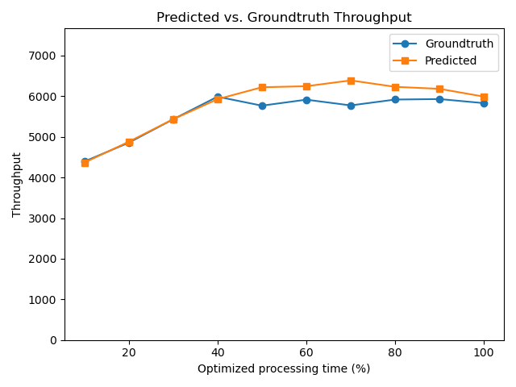
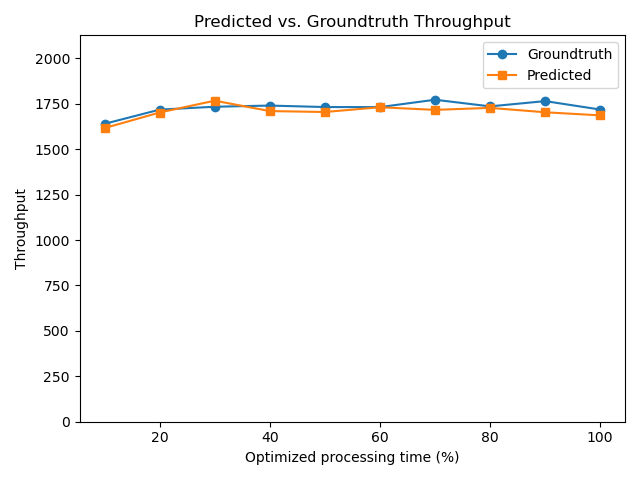
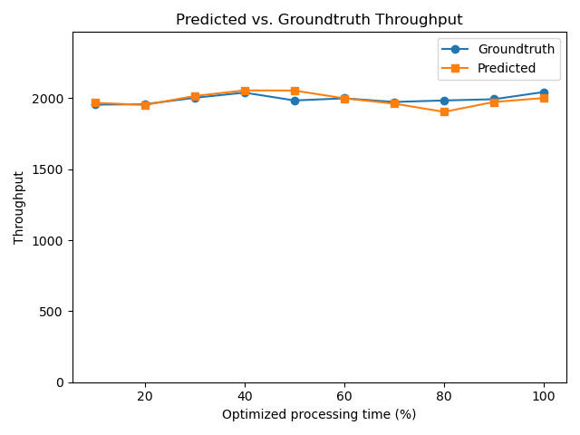
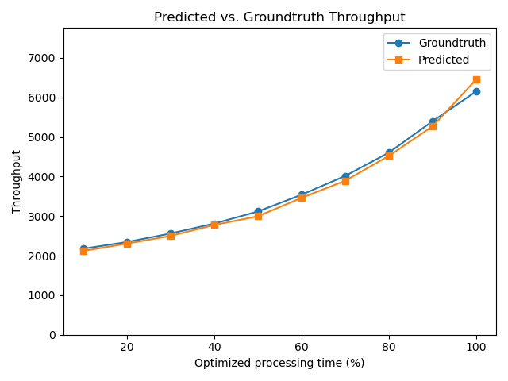

# Overview

The paper makes the following contributions:

1. **Throughput predictor(§2)**: A system, Slowpoke, for predicting throughput optimizations in complex microservice architectures.
2. **Performance model (§3)**: a mathematical model underpinning the Slowpoke optimizations; this model is described in the paper.
3. **Distributed slowdown mechanism (§4)**: a service-local controller for slowing down microservices, Poker, providing runtime information to the model.

Slowpoke is characterized via (1) four real-world microservice applications and (2) synthetic microbenchmarks that cover many different microservice configurations. The artifact focuses on claims no. 1 and 3 (the mathematical model is described the paper), and primarily evaluations with real-world applications (but validating microbenchmarks is tagged as optional, for reviewers).

This artifact targets the following badges:

* [ ] [Artifact available](#artifact-available): Reviewers are expected to confirm that Slowpoke system, benchmarks, and testing scripts are all publicly available (~10mins).
* [ ] [Artifact functional](#artifact-functional): Reviewers are expected to confirm sufficient documentation, key components described in the paper, and execution with one experiment (~20mins).
* [ ] [Results reproducible](#results-reproducible): Reviewers are expected to reproduce key results of section 5 of the paper (~2.5h for real-world benchmarks, optionally 2–3 days for the synthetic benchmarks).

> [!IMPORTANT]
> To reproduce results, this artifact uses a real distributed system on AWS. Remember:
> * Reviewer usernames and passwords have been shared with HotCRP, *please do not share them outside the AEC*.
> * Remember to freeze or turn off the cluster when you're done, as this evaluation is expensive! If you do not know how, ask us via HotCRP—thank you!

# Artifact Available (10 minutes)

Reviewers are expected to confirm that Slowpoke system, benchmarks, and testing scripts are all publicly available:

* Slowpoke is available at [https://github.com/atlas-brown/slowpoke](https://github.com/atlas-brown/slowpoke) (`nsdi26-ae` will be frozen) and [Zenodo `16494184`](https://zenodo.org/records/16494184).

* The [Slowpoke analysis component](app/pkg/slowpoke), [the Poker slowdown component](src/poker/poker.c), the [`benchmarks`](app/cmd/) (command-line entry points) and [`internal/`](app/inernal) (request handlers).

* Top-level scripts in [`slowpoke/`](slowpoke) and ones related to the artifact reproducibility: [`run_function.sh`](evaluation/run_functional.sh) and [`run_reproducible.sh`](evaluation/run_reproducible.sh).

# Artifact Functional (20 minutes)

Confirm sufficient documentation, key components as described in the paper, and execution with minimal inputs:

* Documentation: The top-level [README](README.md) file provides instructions for setting up Kubernetes clusters, installing dependencies, building application images with Slowpoke, generating synthetic benchmarks, and running experiments.
 
* Completeness: (1)Slowpoke user-level library ([initialization](app/pkg/slowpoke/utils.go), [request handler](app/pkg/wrapper/wrappers.go)), (2) Poker slowdown mechanism ([Pause](app/pkg/slowpoke/pause.go), [poker](src/poker/poker.c)), (3) four real-world benchmarks 
([hotel](https://github.com/delimitrou/DeathStarBench/tree/master/hotelReservation), 
 [boutique](https://github.com/GoogleCloudPlatform/microservices-demo),
 [social](https://github.com/delimitrou/DeathStarBench/tree/master/socialNetwork), 
 [movie](https://github.com/delimitrou/DeathStarBench/tree/master/mediaMicroservices)), and [108 synthetic configuration files](evaluation/synthetic/) used with an ([emulator](app/cmd/synthetic/service)) that dynamically changes behavior based on configuration files.
 
* Exercisability: Instructions below access an AWS cluster via a gateway (to allow multiple reviewers to log in at the same time without interfering with each other).

**Exercisability**: To run Slowpoke, we prepared distributed clusters on AWS. To `ssh` into AWS, replace `<UID>` and  `<PASS>` with the username and password shared over HotCRP. 
* **(On local machine)** First `ssh <UID>@18.188.160.170` and use `<PASS>` when prompted for a password.
* **(On the gateway machine)** To start the cluster and ssh into the cluster control node, run `~/scripts/start_ec2_cluster.py -d ~/cluster_info` and `ssh -i ~/cluster_info/slowpoke-expr.pem ubuntu@$(head -n 1 ~/cluster_info/ec2_ips)`—this starts a cluster and `ssh` into its control node.
* **(On the cluster control node)** To confirm it's functional, clone the repo, `cd` into it, checkout `nsdi26-ae`, and run `./evaluation/run_functional.sh`. This will predict the throughput of the `boutique` benchmark after optimizing the execution time of the `cart` service by 1 ms and compare the result against the ground truth.

<details>
 <summary>Explanation</summary>

The cluster is already set up using scripts in this repo under [`scripts/setup/`](scripts/setup) (The cluster contains 2 AWS `m5.xlarge` and 12 `m5.large` EC2 instances. The public IPs of the EC2 machines will be stored in `~/cluster_info/ec2_ips`, first one is the kubernetes control node, the second one is worker node that runs the workload generator, the rest are worker nodes that run the services in each benchmark.

</details>

> While testing the artifact, we discovered kubernetes issue that shows up non-deterministically. Specifically, the `wrk`'s worker node occasionally stop responding. If you notice the time spent in one of the steps take much longer than our estimation below, we advise going back to the gateway machine, stopping and restarting the cluster, and then trying again.

The reviewer should expect a file created at `evaluation/results/boutique_tiny.log` ending with format:
```console
$ tail -n 20 evaluation/results/boutique_tiny.log
...
    Baseline throughput: 1468.873002048123
    Groundtruth: [6274.111213326839]
    Slowdown:    [855.4274013627517]
    Predicted:   [1494.754290608112]
    Error Perc:  [-76.17584005471397]
```
It is worth noting that `run_functional.sh` runs trivially small number of requests so the prediction is not expected to be anywhere near accurate.

* If you wish to stop the cluster, exit from the cluster control node, and **(on the gateway machine)** run `~/scripts/stop_ec2_cluster.py -d ~/cluster_info`. If you wish to continue testing "Result Reproducible", stay in the cluster control node for now.

<details>
 <summary>Explanation</summary>

`./evaluation/run_functional.sh` runs [`./evaluation/boutique/run-boutique-tiny.sh`](evaluation/boutique/run-boutique-tiny.sh), which runs the main testing script with appropriate arguments

</details>

# Results Reproducible (2.5 hours)

> [!IMPORTANT]
> For this step, we recommend using `screen` or `tmux` to avoid accidental disconnect.

**(§5.1, Fig.8) Across four real-world benchmarks**
The key results of Slowpoke's accuracy are shown Fig.8, across several real-world applications. The results reported in the paper take 5 repetitions over 3 central points, to mitigate noise from the applications. To accelerate the artifact evaluation, we only run the experiment once, which should complete in about 2.5 hours. If you have stopped the cluster in the previous step, restart it and `ssh` into it. **On the cluster control node**, first `cd ~/slowpoke`, then:

```console
$ # Recommend doing the following command in screen or tmux
$ ./evaluation/run_reproducible.sh
...
The results are stored in /home/ubuntu/slowpoke/results
To visualize the results, run: 

/home/ubuntu/slowpoke/evaluation/draw.py /home/ubuntu/slowpoke/evaluation/results
```

Several log files in `evaluation/results/` (_e.g._,`boutique_medium.log`, `hotel_medium.log`, `social_medium.log`, and `movie_medium.log`) will grow over time and typically in sub-minute intervals. To plot the results, run:

```console
$ /home/ubuntu/slowpoke/evaluation/draw.py /home/ubuntu/slowpoke/evaluation/results
Result for /home/ubuntu/slowpoke/evaluation/results/boutique_medium.log is available at
http://xx.xx.xx.xx/boutique_medium.png
...
```

These URLs will depict plots comparing the predicted throughput (collected by running Slowpoke) with the actual ground-truth (collected by running the application on the cluster). The log files can also be inspected directly, including confirming that the relative prediction error (_viz._ `Error Perc:` in the log file) is within 10% and mostly around 0-4%. However, it is possible that either baseline or 

<details>
 <summary>
  Sample results for individual plots
 </summary>
 
We did a run on the same environment and the results are stored in [`sample_output/`](evaluation/sample_output)

Boutique



Movie



Hotel



Social


</details>

To create the plot similar to Fig. 8 in the paper, run:

```console
$ ./evaluation/plot_macro.py -r ./evaluation/results
Result for plot_macro.pdf is available at
http://xx.xx.xx.xx/plot_macro.pdf
```

> [!IMPORTANT]
> Reminder: When exiting the cluster remember to run **(on the gateway machine)** `~/scripts/stop_ec2_cluster.py -d ~/cluster_info` to turn off the cluster


Here is the figure we created using this artifact:


# Optional: Applying Slowpoke to All Benchmarks (2–3 days)

We also provide scripts that can recreate results on synthetic microbenchmarks. Each folder inside [`evaluation/synthetic/`](evaluation/synthetic) is a synthetic microbenchmark. To run one of them (for example `chain-d2-grpc-async`), run 

```console
$ ./evaluation/synthetic/chain-d2-grpc-async/run.sh
```

To see results, similar to the main results, do 

```console
$ /home/ubuntu/slowpoke/evaluation/draw.py /home/ubuntu/slowpoke/evaluation/results
```

or manually inspect the log files in the `./evaluation/results` folder. The reviewers should expect the relative prediction error to be within 15%, and mostly around 0-6%. The more extreme errors should appear around the right side of the plot (higher optimization percentages as described in the paper).
