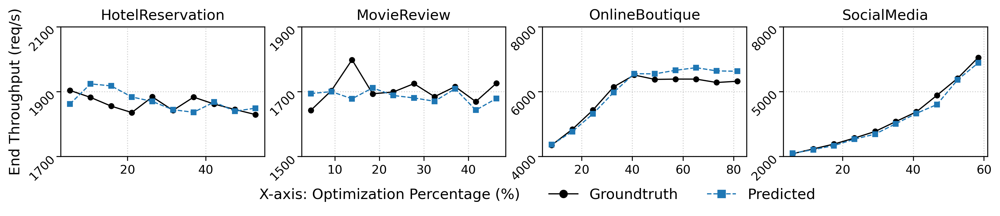

# Slowpoke: End-to-end Throughput Optimization Modeling for Microservice Applications
[Overview](#overview) | [Quick Setup](#quick-setup) | [More Info](#more-information) | [Structure](#repository-structure) | [Citing](#citing-slowpoke) | [License & Contrib](#license-and-contributing)

> For issues and ideas, email [slowpoke@brown.edu](mailto:slowpoke@brown.edu) or, better, [open a GitHub issue](https://github.com/atlas-brown/slowpok/issues/new/choose).
>

Slowpoke is a system for causally profiling microservice applications, by predicting the effects of service-level optimizations on end-to-end throughput of the entire service graph.
It can answer what-if questions of the form "how will the overall throughput of my entire distributed microservice graph improve if I optimize the throughput of this service by 30%?".
It does so by relying on a mathematical model parameterizable by service-level information, rather than end-to-end traces or other a priori information that might not be available at the time one wants to explore optimization opportunities.

If you are interested in evaluating the Slowpoke artifact, switch to the frozen [`nsdi26-ae branch`](https://github.com/atlas-brown/slowpoke/tree/nsdi26-ae) and jump straight into the artifact [instructions](https://github.com/atlas-brown/slowpoke/tree/nsdi26-ae).

## Overview



Slowpoke is a causal profiling system for microservice applications that accurately quantifies the effect of hypothetical optimizations on end-to-end throughput, without relying on tracing or a priori knowledge of the call graph.
Microservice operators can use Slowpoke to ask what-if performance analysis questions of the form "What throughput could my retail application sustain if I optimize the shopping cart service from 10K req/s to 20K req/s?". 
Given a target service and optimization, Slowpoke employs a performance model that determines how to selectively slow down non-target services to preserve the relative effect of the optimization.
It then performs service-local profiling experiments using its `poker` component to predict end-to-end throughput as if the candidate optimization was implemented.

## Quick setup
Using Slowpoke requires a Kubernetes cluster.

<details><summary>(Optional) AWS Setup</summary>
AWS Cluster setup for different account and environment can be quite different. The following setup procedure is just for reference. We do not claim our infrastructure for AWS EC2 setup to be production-ready or reusable as is.

1. Create AWS access token from AWS account.
2. Install `aws-cli` command line tool and set the access token appropriately with aws configure. Also set region explicitly.
3. Modify the `IMAGE_ID` global variable in `scripts/setup/ec2_cluster.py` to be the Ubuntu image in the region you selected (For example, it is `ami-0d1b5a8c13042c939` for us-east-2)
4. Create an empty directory for storing cluster information (For example `~/mycluster`)
5. Run cluster setup with `python3 ./scripts/setup/setup_ec2_cluster.py -d ~/mycluster/ -n 12`. Replace 12 with desired worker count.
6. After the script finishes, run `./scripts/setup/initialize-aws.sh ~/mycluster` to setup kubernetes on each node
7. Connect to the control node by running `ssh -i ~/test_cluster/slowpoke-expr.pem ubuntu@$(head -n 1 ~/mycluster/ec2_ips)`
8. (Optional) If you wish to stop the cluster, but not delete them, run `python3 ./scripts/setup/stop_ec2_cluster.py -d ~/mycluster`
9. (Optional) Similarly, to restart `python3 ./scripts/setup/start_ec2_cluster.py -d ~/mycluster`
10. Finally, if you wish to delete the cluster, run `python3 ./scripts/setup/teardown_ec2_cluster.py -d ~/mycluster`
</details>

## More Info

Currently Slowpoke supports microservices written in Go. Before using Slowpoke (1) add the Slowpoke runtime to the application, (2) update the container configuration to add Slowpoke's `poker` controller, (3) set appropriate per-service pauses when launching a deployment. Then, to launch Slowpoke using `./slowpoke`.

**Using Slowpoke:** In more detail, the required to use Slowpoke:
1. Application: Add in Slowpoke's runtime, modify http request handler registration to use slowpoke handler wrapper, similar to [`cmd/boutique/cart/main.go/`](app/cmd/boutique/cart/main.go/)
2. Container: the application process now needs to start as a subprocess to the poker controller [`slowpoke/poker/poker.c`](src/poker/poker.c). To do this, include Poker's compilation in the container configuration file as well as the entrypoint command change, similar to [`build/PrebuiltDockerfile`](scripts/build/PrebuiltDockerfile). 
3. Deployment: Slowpoke's runtime changes inserts artificial pauses based on environment variables `SLOWPOKE_DELAY_MICROS`, `SLOWPOKE_PRERUN`, `SLOWPOKE_POKER_BATCH_THRESHOLD`, and `SLOWPOKE_IS_TARGET_SERVICE`. Set these values accordingly when launching a deployment, or programatically pass in the values similar to [`slowpoke/boutique/yamls/cart.yaml`](evaluation/boutique/yamls/cart.yaml).

**Launching Slowpoke:**Eventually, launcing Slowpoke's end-to-end profiling by running `./slowpoke`: 

```console
$ slowpoke --help
usage: test.py [-h] [-b BENCHMARK] [-t NUM_THREADS] [-c NUM_CONNS] [-x TARGET_SERVICE] [-r REQUEST_TYPE]
               [--repetitions REPETITIONS] [--num_exp NUM_EXP] [--pre_run] [--range RANGE RANGE] [--num_req NUM_REQ]
               [--clien_cpu_quota CLIEN_CPU_QUOTA] [--random_seed RANDOM_SEED] [--poker_batch POKER_BATCH]
               [--poker_batch_req POKER_BATCH_REQ] [--poker_relative_batch POKER_RELATIVE_BATCH]

options:
  -h, --help            show this help message and exit
  -b BENCHMARK, --benchmark BENCHMARK
                        the benchmark to run the experiment on
  -t NUM_THREADS, --num_threads NUM_THREADS
                        the number of threads to run the experiment on
  -c NUM_CONNS, --num_conns NUM_CONNS
                        the number of connections to run the experiment on
  -x TARGET_SERVICE, --target_service TARGET_SERVICE
                        the target service to run the experiment on
  -r REQUEST_TYPE, --request_type REQUEST_TYPE
                        the request type to run the experiment on
  --repetitions REPETITIONS
                        the number of repetitions to run the experiment on
  --num_exp NUM_EXP     the number of experiments to run
  --pre_run             whether to run the experiment with prerun
  --range RANGE RANGE
  --num_req NUM_REQ
  --clien_cpu_quota CLIEN_CPU_QUOTA
  --random_seed RANDOM_SEED
  --poker_batch POKER_BATCH
  --poker_batch_req POKER_BATCH_REQ
  --poker_relative_batch POKER_RELATIVE_BATCH
```

For example:

```sh
./slowpoke -b hotel -r mix -x profile --num_exp 10 -t 8 -c 1024 --poker_batch_req 100 --repetition 3 --num_req 50000
```

## Repository Structure

This repository contains the core development for Slowpoke. The directory structure is organized as follows:

* [app](app): Real-world and synthetic applications augmented with the Slowpoke user [library](app/pkg/slowpoke).
* [src](src): Control node component that orchestrates experiments, computes delays, and predicts end-to-end throughput improvement. Also includes [`poker`](src/poker/poker.c), the control process that runs alongside the application within the same container.
* [scripts](scripts): Helper scripts for building application images and setting up EC2 clusters.
* [client](client): Load generator for benchmarking different applications.
* [evaluation](evaluation): YAML files and scripts used to evaluate Slowpoke's accuracy across four real-world and 108 synthetic applications.

## Citing Slowpoke

If you are using Slowpoke, `poker`, or any of components in this repository, please cite the following research:

```bibtex
@inproceedings{slowpoke:nsdi:2026,
  author = {Yizheng Xie and Di Jin and Oğuzhan Çölkesen and Vasiliki Kalavri and John Liagouris and Nikos Vasilakis},
  title = {Slowpoke: End-to-end Throughput Optimization Modeling for Microservice Applications},
  booktitle = {23rd USENIX Symposium on Networked Systems Design and Implementation (NSDI 26)},
  year = {2026},
  address = {Renton, WA},
  publisher = {USENIX Association},
  month = may
}
```

## License & Contributing

Slowpoke is an open-source, collaborative, [MIT-licensed](https://github.com/atlas-brown/slowpoke/blob/main/LICENSE) project developed between the [ATLAS group](https://atlas.cs.brown.edu/) at [Brown University](https://cs.brown.edu/) and the [CASP group](https://sites.bu.edu/casp/) at [Boston University](https://www.bu.edu/cs/). If you'd like to contribute, please see the [`CONTRIBUTING.md`](CONTRIBUTING.md) file—we welcome contributions! And please come talk to us if you're looking to optimize microservices!

